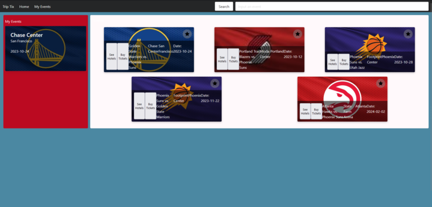

# Bootcamp-Project-1#

https://chart099.github.io/Bootcamp-Project-1/

## Description
This is an app that allows the user to search for an event by city name, event or artist name and then displays the relevent events. Once the events are shown, the user has the ability to save the event as a favorite and view later using local storage or find a hotel that is near that event location and attached to the saved event. 

## Installation

N/A

## Usage

The purpose of this app is to help users find desired events and then find hotels located near that event and save them together. 

## License

MIT